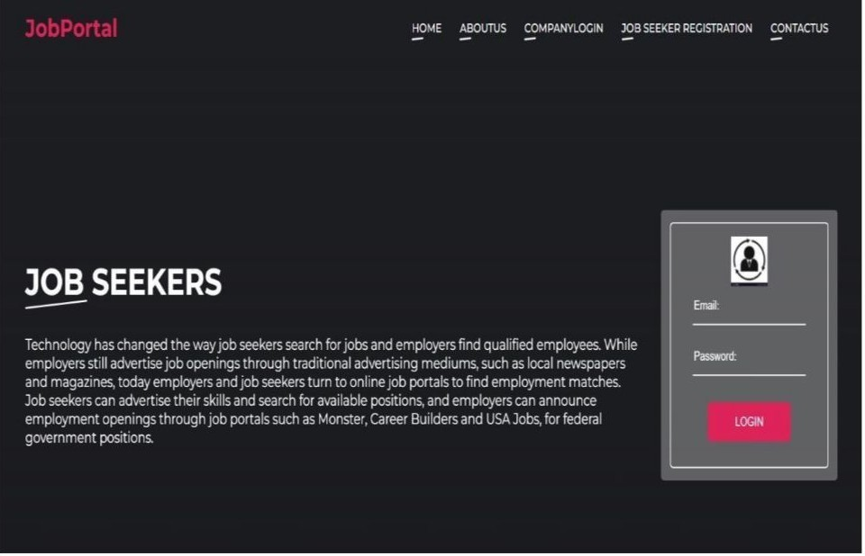
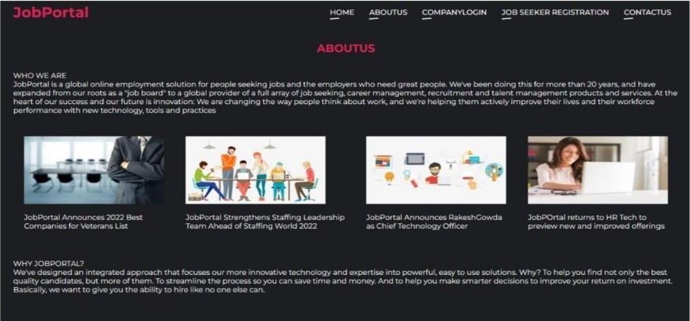
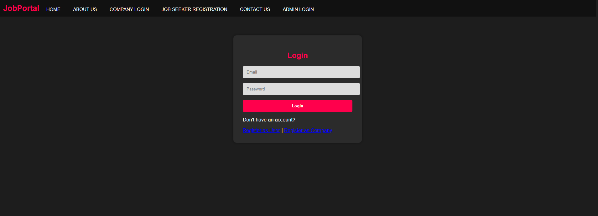
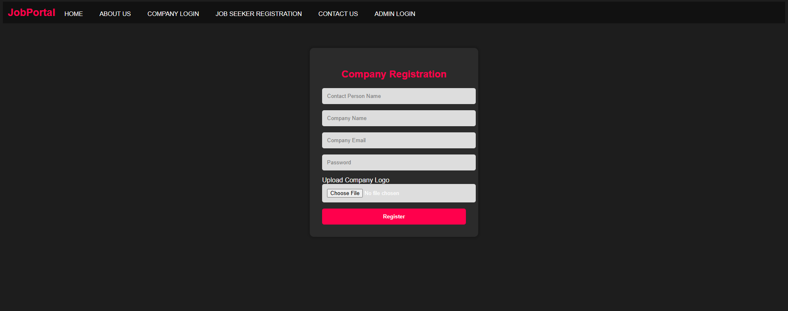
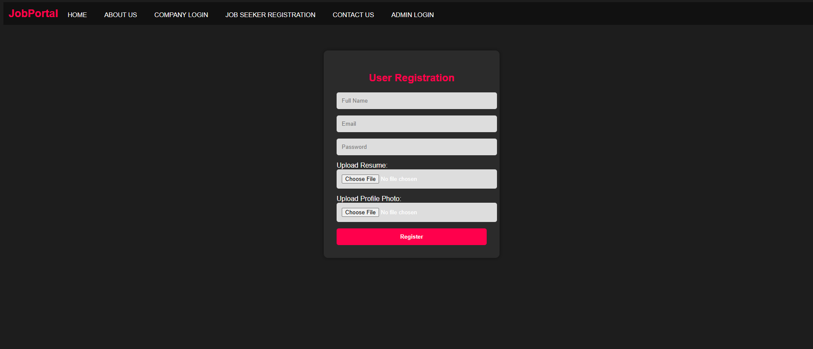
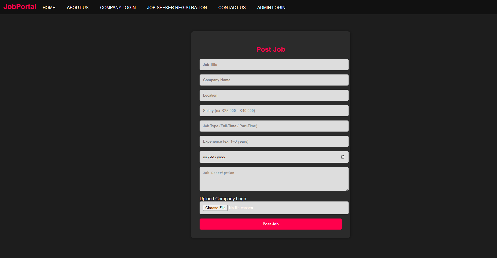

# Online Job Portal Website

This is a responsive Online Job Portal Website developed using Python, HTML, CSS, and JavaScript.

## Features

* User Registration and Login
* Job Listings
* Search and Filter Functionality
* Responsive User Interface
* Database Integration

## Technologies Used

* Python
* Flask
* HTML
* CSS
* JavaScript
* SQLite

## Purpose

This project was created to improve web development skills and build a simple job portal platform for users and recruiters.

## HOMEPAGE

## ABOUT US PAGE

## LOGIN PAGE

## COMPANY REGISTRATION PAGE

## USER REGISTRATION PAGE

## JOB POSTING PAGE

